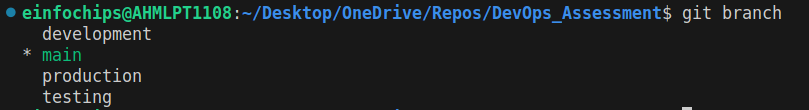
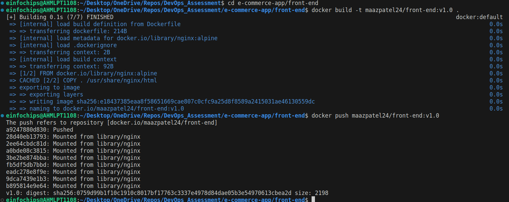
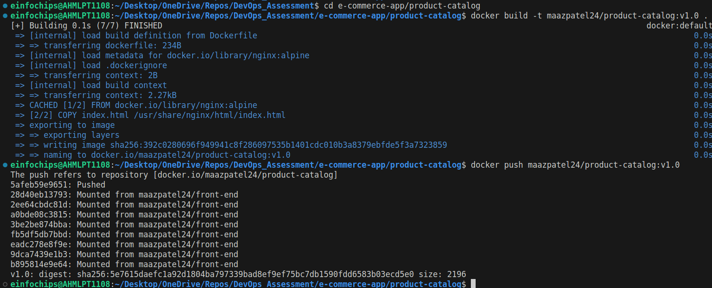
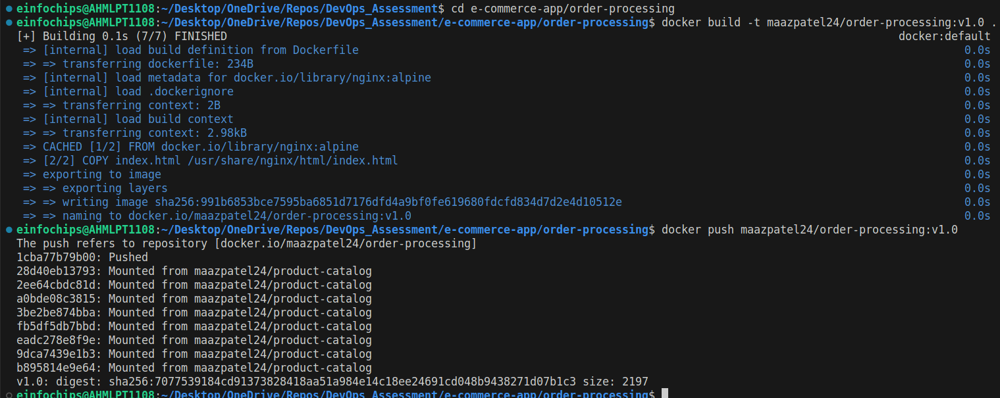

# Assessment: Use Case Oriented Project
## Project Overview
You are tasked with setting up a CI/CD pipeline for a microservices-based application. The
application will be containerized using Docker and orchestrated using Kubernetes. Ansible
will be used for configuration management and deployment. The entire setup should be
managed using Git for version control, and Jenkins will be used to automate the CI/CD
process.

## Assessment Criteria
1. **Git:**
    + Repository setup
    + Branching strategies
    + Commit and merge practices
2. **Jenkins:**
    + Pipeline creation using Jenkinsfile
    + Integration with Git
    + Automated build, test, and deployment stages
3. **Docker:**
    + Dockerfile creation
    + Image building and management
    + Containerization of microservices
4. **Kubernetes:**
    + Pod and service creation
    + Deployments and replica sets
    + ConfigMaps and Secrets
5. **Ansible:**
    + Playbook creation
    + Use of variables and templates
    + Inventory management

## Use Case Scenario
Your company is developing a new e-commerce application consisting of several
microservices: a front-end service, a product catalog service, and an order processing
service. The goal is to automate the deployment and configuration of these services across
development, testing, and production environments using Ansible, Docker, Kubernetes, and
Jenkins.

---

# Tasks and Deliverables

## Task 1: Git Repository Setup
1. **Create a Git repository** to store all project files, including Ansible playbooks,
Dockerfiles, and Kubernetes manifests.
2. **Branching Strategy:**
    + Create branches for development, testing, and production.
    ```sh
    git branch <branch_name>  # create a branch
    git checkout <brach_name>  # checkout particular branch
    git add <file_name>  # stage the <file_name>
    git commit -m "commit-message"  # commit the changes in repository.
    git push origin <branch_name>  # push the changes to remote repository in particular branch 
    ```
    

    + Implement a strategy for merging changes from development to testing and
production.


## Task 2: Dockerize Microservices
1. **Create Dockerfiles** for each microservice (front-end, product catalog, order
processing).
```sql
e-commerce-app/
│
├── docker-compose.yml
├── front-end/
│   ├── Dockerfile
│   └── index.html
├── product-catalog/
│   ├── Dockerfile
│   └── index.html
└── order-processing/
    ├── Dockerfile
    └── index.html
```
2. **Build Docker images** for each microservice and push them to a container registry
(e.g., Docker Hub).

+ Build front-end image
```bash
cd e-commerce-app/front-end
docker build -t your-dockerhub-username/front-end:v1.0 .
docker push your-dockerhub-username/front-end:v1.0
```


+ Build product-catalog image
```bash
cd e-commerce-app/product-catalog
docker build -t your-dockerhub-username/product-catalog:v1.0 .
docker push your-dockerhub-username/product-catalog:v1.0
```


+ Build order-processing image
```bash
cd e-commerce-app/order-processing
docker build -t your-dockerhub-username/order-processing:v1.0 .
docker push your-dockerhub-username/order-processing:v1.0
```



3. **Deliverables:**
    + Dockerfiles for each microservice
    + Built Docker images in a container registry

## Task 3: Kubernetes Deployment
1. **Create Kubernetes manifests** for deploying each microservice.
    + Define Pods, Services, Deployments, and ReplicaSets.
    + Use ConfigMaps and Secrets for configuration management.
2. **Deploy the microservices** to a Kubernetes cluster.
3. **Deliverables:**
    + Kubernetes manifests (YAML files)
    + Successful deployment of microservices in the Kubernetes cluster

## Task 4: Ansible Configuration Management
1. **Create Ansible playbooks** to manage the deployment and configuration of the
microservices.
    + Use variables to handle environment-specific configurations.
    + Utilize Jinja2 templates to dynamically generate configuration files.
2. **Set up Ansible inventories** to manage different environments (development,
testing, production).
3. **Deliverables:**
    + Ansible playbooks
    + Ansible inventory files
    + Jinja2 templates for configuration files

## Task 5: Jenkins CI/CD Pipeline
1. **Set up a Jenkins pipeline** using a Jenkinsfile.
    + Integrate with Git to trigger the pipeline on code changes.
    + Define stages for building Docker images, pushing them to the registry,
deploying to Kubernetes, and running tests.
2. **Implement error handling** and notifications to alert the team on failures.
3. **Deliverables:**
    + Jenkinsfile defining the CI/CD pipeline
    + Screenshots or logs demonstrating successful pipeline execution

---

## Evaluation Criteria
Participants will be evaluated based on the following:
1. **Git:**
    + Proper repository setup with clear structure and documentation
    + Effective branching strategy and merge practices
2. **Docker:**
    + Correct and efficient Dockerfile creation
    + Successful building and pushing of Docker images
3. **Kubernetes:**
    + Accurate and functional Kubernetes manifests
    + Successful deployment and management of microservices in the cluster
4. **Ansible:**
    + Well-structured playbooks with proper use of variables and templates
    + Effective inventory management for different environments
5. **Jenkins:**
    + Comprehensive and functional Jenkins pipeline
    + Proper integration with Git and handling of build, test, and deployment stages
    + Effective error handling and notifications

## Submission
Participants should submit the following:
+ Git repository URL with all project files
+ Docker Hub repository links to the built images
+ Screenshots or logs of the Kubernetes deployment
+ Jenkins pipeline execution logs or screenshots
+ Detailed documentation explaining the setup and configurations